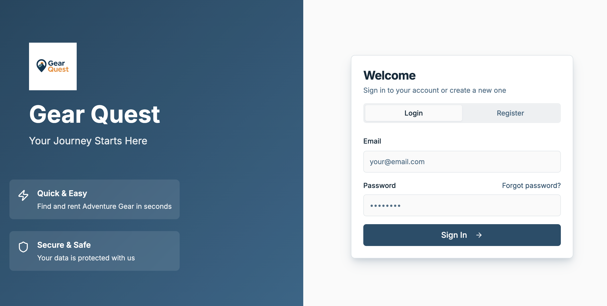
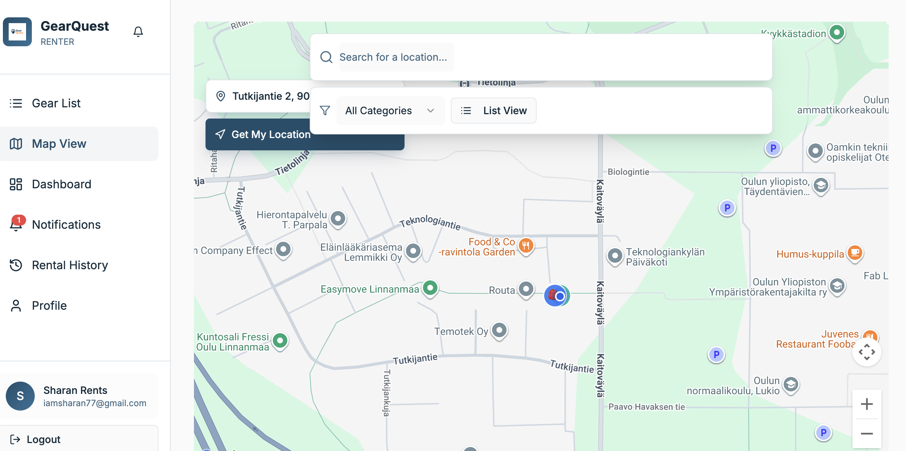
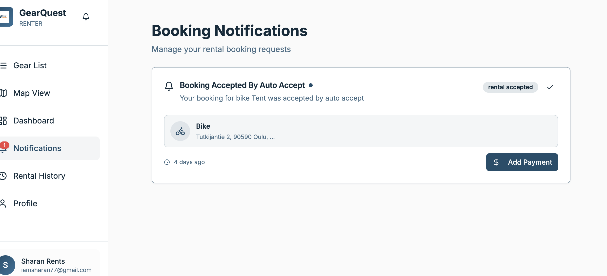

# Gear Quest - Rent Adventure Gear Anywhere

A modern, full-featured bike and adventure gear rental platform built with React, TypeScript. Gear Quest connects gear owners with renters, making it easy to find and rent adventure gear in your area.

## 📸 Screenshots







## 🚀 Features

### For Renters
- **Interactive Map View**: Browse available bikes and gear on an interactive Google Maps interface
- **Advanced Search & Filters**: Filter by category, price, location, and availability
- **Detailed Listings**: View comprehensive bike/gear details including images, features, reviews, and ratings
- **Booking System**: Easy booking with date selection and instant booking requests
- **Payment Integration**: Secure payment processing via Stripe
- **Rental History**: Track all your past and current rentals
- **Real-time Notifications**: Get instant updates on booking status and messages
- **Profile Management**: Manage your personal information and preferences

### For Owners
- **Bike/Gear Management**: Add, edit, and manage your rental inventory
- **Rental Requests**: Review and approve/decline rental requests
- **Active Rentals Dashboard**: Monitor all your active rentals
- **Analytics**: View rental statistics and earnings
- **Image Upload**: Upload multiple images for your listings via S3
- **Availability Management**: Set availability dates and pricing

### General Features
- **Progressive Web App (PWA)**: Install and use as a native app
- **Real-time Updates**: Socket.io integration for live notifications
- **Role-based Access Control**: Separate interfaces for renters and owners
- **Responsive Design**: Works seamlessly on desktop, tablet, and mobile devices
- **Dark Mode Support**: Theme switching capability
- **Email Verification**: Secure email verification flow
- **Password Recovery**: Forgot password and reset functionality

## 🛠️ Tech Stack

### Frontend
- **React 18** - UI library
- **TypeScript** - Type safety
- **Vite** - Build tool and dev server
- **React Router** - Client-side routing
- **TanStack Query** - Data fetching and caching
- **Tailwind CSS** - Styling
- **shadcn/ui** - UI component library
- **Radix UI** - Accessible component primitives

### Backend & Services
- **Stripe** - Payment processing
- **Google Maps API** - Map integration
- **Socket.io** - Real-time communication
- **AWS S3** - Image storage

### Additional Libraries
- **React Hook Form** - Form management
- **Zod** - Schema validation
- **date-fns** - Date manipulation
- **Recharts** - Data visualization
- **Sonner** - Toast notifications

## 📋 Prerequisites

Before you begin, ensure you have the following installed:
- **Node.js** (v18 or higher)
- **npm** or **bun** package manager

- **Google Maps API** key
- **Stripe** account (for payment processing)
- **AWS S3** bucket (for image uploads)

## 🔧 Installation

1. **Clone the repository**
   ```bash
   git clone <repository-url>
   cd bike-hive-hub
   ```

2. **Install dependencies**
   ```bash
   npm install
   # or
   bun install
   ```

3. **Set up environment variables**
   
   Create a `.env` file in the root directory with the following variables:
   ```env
 
   VITE_GOOGLE_MAPS_API_KEY=your_google_maps_api_key
   VITE_STRIPE_PUBLISHABLE_KEY=your_stripe_publishable_key
   VITE_API_BASE_URL=your_api_base_url
   VITE_S3_BUCKET_NAME=your_s3_bucket_name
   VITE_S3_REGION=your_s3_region
   VITE_S3_ACCESS_KEY_ID=your_s3_access_key
   VITE_S3_SECRET_ACCESS_KEY=your_s3_secret_key
   ```

4. **Start the development server**
   ```bash
   npm run dev
   # or
   bun dev
   ```

   The app will be available at `http://localhost:8080`

## 📜 Available Scripts

- `npm run dev` - Start development server
- `npm run build` - Build for production
- `npm run build:dev` - Build for development
- `npm run preview` - Preview production build
- `npm run lint` - Run ESLint

## 🏗️ Project Structure

```
bike-hive-hub/
├── src/
│   ├── components/          # Reusable UI components
│   │   ├── layout/          # Layout components (Sidebar, DashboardLayout)
│   │   ├── notifications/   # Notification components
│   │   └── ui/              # shadcn/ui components
│   ├── contexts/            # React contexts (Auth, Booking, etc.)
│   ├── hooks/               # Custom React hooks
│   ├── integrations/        # Third-party integrations
│   ├── lib/                 # Utility functions and API clients
│   ├── pages/               # Page components
│   │   ├── owner/           # Owner-specific pages
│   │   └── renter/          # Renter-specific pages
│   ├── services/            # API service functions
│   └── types/               # TypeScript type definitions
├── public/                  # Static configuration
└── dist/                    # Production build output
```


## 🗺️ Key Pages & Routes

### Public Routes
- `/login` - User login
- `/forgot-password` - Password recovery
- `/reset-password` - Password reset
- `/verify-email` - Email verification

### Renter Routes
- `/map` - Interactive map view
- `/renter/gear-list` - List view of available gear
- `/bike/:bikeId` - Bike/gear details
- `/payment` - Payment processing
- `/history` - Rental history
- `/notifications` - Notifications center

### Owner Routes
- `/dashboard` - Owner dashboard
- `/bikes` - Manage bikes/gear
- `/rentals` - Active rentals
- `/rental-requests` - Manage rental requests
- `/notifications` - Notifications center

## 🎨 UI Components

The project uses **shadcn/ui** components built on Radix UI primitives, providing:
- Accessible components
- Customizable styling with Tailwind CSS
- Dark mode support
- Responsive design

## 📱 Progressive Web App

The app is configured as a PWA with:
- Service worker for offline support
- Installable on mobile and desktop
- App icons and manifest
- Caching strategies for Google Maps

## 🔌 Real-time Features

Socket.io integration provides:
- Real-time notifications
- Live booking status updates
- Instant messaging capabilities

## 🧪 Development

### Code Style
- ESLint for code linting
- TypeScript for type safety
- Prettier (if configured) for code formatting

### Best Practices
- Component-based architecture
- Custom hooks for reusable logic
- Context API for state management
- React Query for server state
- Protected routes for authentication

## 🚢 Deployment

1. **Build the project**
   ```bash
   npm run build
   ```

2. **Deploy the `dist` folder** to your hosting provider (Vercel, Netlify, etc.)

3. **Configure environment variables** on your hosting platform

4. **Set up CORS** if needed for API calls

## 📝 Environment Variables

Make sure to configure all required environment variables in your hosting platform:
- Google Maps API key
- Stripe keys
- API base URL
- S3 credentials

## 🤝 Contributing

1. Fork the repository
2. Create a feature branch (`git checkout -b feature/amazing-feature`)
3. Commit your changes (`git commit -m 'Add some amazing feature'`)
4. Push to the branch (`git push origin feature/amazing-feature`)
5. Open a Pull Request

## 📄 License

This project is private and proprietary.

## 👥 Support

For support, please contact the development team or open an issue in the repository.

---
